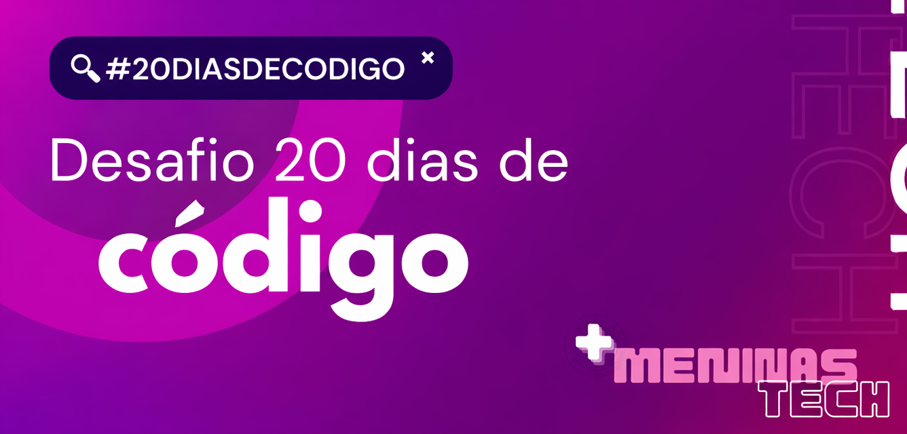

# Desafio 20 Dias de Código 

Este repositório foi criado para documentar minha participação no **Desafio 20 Dias de Código**, uma iniciativa do **Mais Meninas Tech**, com o objetivo de fortalecer minha relação com a programação por meio da **constância e prática diária**. Ao longo dos 20 dias, registrarei minhas soluções e aprendizados, dedicando cerca de **30 minutos por dia** para evoluir em lógica, resolução de problemas e desenvolvimento em **Python**.

## Objetivo
Criar o hábito de programar todos os dias e fortalecer a base de lógica, resolução de problemas e escrita de código limpo.

## Tecnologias
- Python 3.11
- Beecrowd
- Git & GitHub

## Resumo por dia
- **Dia 01** – Hello World (Beecrowd Bee 1000) 
- **Dia 02** – Extremamente Básico (Beecrowd Bee 1001)
- **Dia 03** – Área do Círculo (Beecrowd Bee 1002)
- **Dia 04** – Soma Simples (Beecrowd Bee 1003)
- **Dia 05** – Produto Simples (Beecrowd Bee 1004)
- **Dia 06** – Média (Beecrowd Bee 1005)
- **Dia 07** – Média 2 (Beecrowd Bee 1006)
- **Dia 08** – Diferença (Beecrowd Bee 1007)
- **Dia 09** – Salário (Beecrowd Bee 1008)
- **Dia 10** – Salário com Bônus (Beecrowd Bee 1009)
- **Dia 11** – Cálculo Simples (Beecrowd Bee 1010)
- **Dia 12** – Esfera (Beecrowd Bee 1011)
- **Dia 13** – Área (Beecrowd Bee 1012)
- **Dia 14** – O Maior (Beecrowd Bee 1013)
- **Dia 15** – Consumo (Beecrowd Bee 1014)
- **Dia 16** – Distância Entre Dois Pontos (Beecrowd Bee 1015)
- **Dia 17** – Distância (Beecrowd Bee 1016)
- **Dia 18** – Gasto de Combustível (Beecrowd Bee 1017)
- **Dia 19** – _(em andamento)_
- **Dia 20** – _(em andamento)_

## Selos e Certificações

Ao final do desafio, participantes com pelo menos **75% de presença** poderão receber certificado de conclusão.

**Status atual:** em progresso  
**Meta:** concluir os 20 dias do desafio  
**Certificado:** será adicionado aqui após a conclusão

## Autor(a)
**Gabriela Raposo**  

